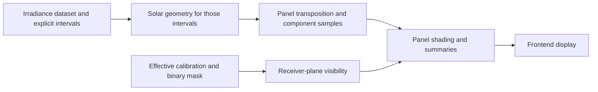

# Application architecture

Implemented ownership after the September 2026 library/frontend rewrite. The [approved plan](LIBRARY_FRONTEND_REWRITE_PLAN.md) records the requirements; [RUNNING](../src/ApplicationFrontend/RUNNING.md) explains the packaged workflow and output formats.

## Boundary

`ApplicationFrontend` collects input, selects library operations, sequences stages, coordinates caches, reports progress/cancellation, records a run manifest and renders returned results. It supplies output destinations to the library exporters. It contains no scientific `PanelEngine`, interval selection algorithm, DNI inference, sky integration, shading correction, energy/loss derivation or scientific workbook schema. The separate PV Autonomy workspace calls the PV/battery libraries only after a current, complete Solar Irradiance result is available.

Scientific algorithms and their file formats remain in the existing libraries. The new panel capability extends the original libraries rather than putting all frontend calculations into another catch-all engine. Generic settings/manifest persistence, input hashing, image-preview resizing and chart coordinates remain frontend responsibilities.

`SolarShade.MaskEditor` is a separate WPF module. Its modal window receives an oriented full-resolution photo, a binary starting mask and lens-disk guide, then returns edited PNG bytes and a label through a save callback. It owns brush strokes, undo/redo, opacity and zoom; it does not reference frontend orchestration or scientific libraries. `ApplicationFrontend` validates and stores immutable variants in `Data/Masks`, selects the active mask, and records its AI ancestor and edit provenance in `02-sky-mask/mask-provenance.json`. The shading library still receives the same binary mask type.

Completed accepted studies are archived under `Data/AcceptedResults` with content-addressed artifact blobs. An exact input match is hash-verified and republished into the one current `Debug Data` dataset without scientific recomputation. Matching PV results have a separate archived scope and are rebound to the restored irradiance result. New mask selections invalidate the mask and shading groups while retaining independent solar, weather, transposition and geometric overlays. Returning to a prior mask or photo restores green/export-ready state only after full source and artifact verification.

## Stage ownership and APIs

| Stage | Owning library | Application-facing operations |
|---|---|---|
| Calibration | `SolarShade.Calibration.Solver`, `.Validation`, `SolarShade.Camera` | `CalibrationWorkflow.Calibrate`; `CameraProfileFiles.Load` and `Export`. The workflow composes the unchanged solver with the independent numerical validator. |
| Sky masking | `SkyPhotoMasking` | `SkyPhotoMasker.CreateMaskDetailed` / `CreateMaskToDirectory`; `SkyMaskExporter.Export` / `Load`. |
| Irradiance | `SolarShade.Irradiance` | `IrradianceClient.FetchDatasetAsync`; `IrradianceDatasetFiles.Import` / `Export`; `IrradianceDatasets.SelectCalendarRange` and validation. |
| Solar positions | `SolarShade.Shading` | `SolarPositionModule.PrepareIntervals` / `PrepareIntervalsToWorkbook`; `SolarIntervalWorkbook.Export`. |
| Transposition | `SolarShade.Irradiance.Transposition` | `TranspositionModule.ComputePrepared` / `ExportPrepared`. Its existing kernel owns DNI inference and direct/isotropic/circumsolar components. |
| Shading | `SolarShade.Shading` and `SolarShade.ShadingCorrection` | `PanelSkyScene`, `CameraPose.FromImageBottom`; `ShadingCorrectionModule.ApplyToPanel` / `ExportPanel`. Correction owns interval results, coverage bounds, transmission, energy and loss summaries. |
| PV autonomy | `SolarShade.PvBattery`, `.Integration`, `.IO` | `PanelBatterySimulation.Compute` adapts the accepted `PanelRun` to the battery simulator; `BatteryFiles` writes the optional CSV, JSON and XLSX result. |

The frontend binds directly to the correction library's `PanelRun` and `PanelRow` values. The optional correction delegate in `AppServices` is an integration seam used by tests to verify that distinct library results reach the UI-bound result unchanged.

Computational and export APIs remain separate where cache reuse needs to persist an already-computed result. Library stage wrappers combine them for headless use. A stage completes only after its required artifacts have been written; low-level scalar and per-pixel operations do not write files.

## Authoritative time series

The .NET 8 irradiance library owns the portable contracts:

- `IrradianceInterval`: stable ID, original timestamp label, full source bounds, selected/clipped bounds, BHI and DHI.
- `IrradianceDataset`: ordered intervals, provider/import provenance, time zone, label convention, native cadence when regular, units/value kind, retrieval time and optional source coordinates.
- `SolarGeometrySample`: timestamp, geometric/apparent zenith, azimuth and mean quadrature weight.
- `SolarIntervalGeometry`: one source interval, position at its label, full-source samples and selected-bound samples.
- `SolarTimeline`: original dataset, corresponding interval geometry and documented conventions.

The time-dependent order is:

Hourly inputs remain hourly; 15-minute inputs remain 15-minute. Explicit variable intervals remain variable. Cadence is not guessed from gaps between labels. Missing coverage is reported with its actual bounds, with no interpolation, filling or hidden aggregation. Unsupported accumulated-energy/instantaneous imports are rejected by the interval-mean pipeline.

The current application provider endpoints request hourly means. Their result metadata declares that cadence and label convention. A higher solar quadrature count does not create higher-resolution weather.

Solar geometry includes diffuse-only and nighttime rows. Whole-source geometry establishes the daylight cosine used for DNI inference. The transposition/correction stages integrate only the selected bounds, preserving the complete source label/bounds separately. Weights sum to one for each quadrature domain; energy uses the selected interval's actual duration. The solar stage rejects a requested site that contradicts recorded source coordinates.

## Preserved numerical behavior

- The calibration solver and segmentation algorithms/models are retained. Native YAML uses ascending coefficients in radians and oriented image coordinates. Effective coverage remains explicit and can be provisional.
- The prepared panel calculation uses the existing NOAA/Meeus geometric solar calculation and existing explicit apparent-angle conversion.
- DNI is inferred over the full source interval; DNI during daylight and DHI are treated as constant within that source interval. Boundary clipping does not re-infer atmospheric inputs.
- Transposition owns direct, isotropic and circumsolar contributions. Panel correction applies receiver visibility at each sample before temporal averaging.
- The panel workflow supports Hay–Davies/isotropic sky diffuse and preserves horizontal identity. It does not introduce Perez obstruction shading or ground reflection.
- Unknown sky is blocked in the main curve; an upper bound assumes it open. Transmission is shaded/unshaded, whereas the original horizontal correction API retains its established loss convention. Undefined zero-baseline ratios remain null/blank.

Original standalone APIs remain available. The legacy uniform-window shading file adapter reads regular native irradiance workbooks, including 15-minute data, and rejects a caller window inconsistent with their metadata. Clipped/variable intervals must use the new `PrepareIntervals` path because the legacy single-window contract cannot represent them faithfully.

## Debug Data and cache lifecycle

The application maintains one current published Solar Irradiance dataset under top-level `Debug Data`. Explicit updates replace only invalid artifacts; a verified unchanged update retains its run identity and files. Numbered folders contain native calibration YAML/profile, binary mask PNG/metadata, raw irradiance XLSX, solar position/integration XLSX, unshaded panel/component XLSX, and shaded/visibility/transmission XLSX plus result JSON. Calibration-only calls use the same `01-calibration` schema. An optional `07-battery` folder has its own manifest and is valid only for its exact accepted irradiance result and PV settings.

Each owning exporter writes the returned values. Diagnostics do not run another scientific calculation merely to populate Excel. Large integration outputs are split into additional sheets or files. Per-file publication is atomic; a later failure may leave earlier valid artifacts, but the run is not marked complete.

Correction exports carry panel orientation, source/time-zone/cadence metadata, source coordinates when known, dataset fingerprint and solar convention. The actual requested calculation site is recorded by the solar stage and run manifest; source coordinates in a standalone correction export must not be mistaken for that requested site.

`DebugDataRun` stores settings, input fingerprints, library versions, stage origins/status and relative artifact paths. It verifies reported files exist inside the run. Cached values are exported through their library when an affected stage needs publication, and the origin identifies reuse. Manual Export copies a successful run and publishes its completed manifest last. PV export verifies and copies its three files plus its separate manifest; it does not add PV files to the irradiance export.

Cache responsibilities in `AppServices`:

- Irradiance: source request/import content, selected dates, zone, fallback interval settings and irradiance library identity. Disk cache uses the irradiance library's native workbook importer/exporter.
- Mask: image content, model/resolution/disk settings and library/package identity. Disk cache uses the mask library's PNG/metadata loader/exporter.
- Solar: complete selected dataset and interval fingerprint, site/elevation, quadrature count and contributing library identities.
- Visibility: mask/profile fingerprints, effective coverage, camera pose and shading library identity; panel-independent disk moments are reused by the library.

Panel edits reuse the source data and solar geometry, then recompute transposition/correction. Location, time-axis or relevant library changes invalidate dependent work. Cache keys and values are published together after successful computation. Native calibration/masking calls remain serialized. They do not interrupt mid-native-call; cancellation is checked around them and during output. Only the newest UI revision is displayed. Normal input editing and startup do not enumerate historical Debug Data folders; `DebugDataStore.CleanHistory` is an explicit maintenance operation.

## Sun-path diagnostic overlay

`CalibratedSkyProjection` is the shared lightweight projection used by shading and `SunPathOverlayGenerator`. It validates the effective lens profile and camera pose without loading a mask or preparing diffuse visibility. The generator consumes existing selected `SolarTimeline` samples, uses their apparent solar directions, groups tracks in the display time zone, and splits them at night, missing coverage, time gaps and projection discontinuities. It does not compute another ephemeris or change irradiance cadence.

Native pixel paths are simplified with a maximum 0.35-pixel input-point deviation and rasterized with subpixel coordinates into a constant-opacity transparent yellow PNG. All selected samples are inspected; days are not omitted. `SunPathOverlayExporter` saves that exact image, the retained vertices with source sample references, and metadata under `04-solar-positions`. Full integration samples already have their own numerical workbook, so the overlay workbook does not duplicate them.

`AppServices` caches the overlay using solar timeline identity, effective calibration, image dimensions/disk, camera pose, display zone and library version. Segmentation pixels, panel orientation and diffuse model are not projection inputs. It publishes the image before large numerical exports and shading work. The frontend displays the native mask and overlay within one shared viewport, clears stale content on input changes, rejects old callbacks, and persists a visibility-only toggle. Resizing and toggling do not regenerate the overlay. Missing calibration/image leaves the overlay unavailable.

Performance benchmarks measure projector construction, all selected sample projection, simplification, rendering and native PNG encoding from prepared geometry. Solar preparation and native artifact export are reported separately, including cold and warm calls; the subsecond target concerns the incremental full-year overlay image.

## Cardinal-direction diagnostic overlay

`CardinalDirectionOverlayGenerator` and its exporter live in the existing shading library. Four constant-azimuth meridians are projected using `CalibratedSkyProjection` and the same `CameraPose` as solar projection and shading. The visible meridian endpoints anchor magenta ticks; upright labels are placed for display. The generator respects the lens coverage, image rectangle and detected disk rather than assuming all horizon points are in view. It has no irradiance or solar-timeline dependency and does not mirror compass labels independently of the projection.

The frontend owns preview sequencing, cancellation, cache keys and visibility only. A separate orientation preview revision allows pose/image/calibration changes to refresh without waiting for weather retrieval or requiring unrelated inputs to be valid. Relevant edits clear stale markers; unrelated edits preserve the current image. The original photo and transparent PNG share one coordinate transform. `02-orientation` records the exact library PNG, compact numerical XLSX and metadata in Debug Data.

## Dependency direction and packaging

Irradiance and transposition remain .NET 8 libraries. The Windows .NET 10 solar/shading library consumes their portable contracts and references transposition to reuse the existing angle conversion. Transposition references irradiance, not masks/shading/correction. Shading correction references transposition and shading. Calibration validation's composition wrapper references Solver and Camera; the solver has no validator dependency. These references are acyclic.

`Example/Irradiance` holds the original bundled raw workbook. `Example/Debug Data/reference-run` is a fixed verified run of the native irradiance stages. Current user calculations write to the top-level `Debug Data`; durable camera profiles are copied to `Data/Profiles`. `Data` also holds settings, protected selected inputs, caches and extracted embedded weights.

A scientific library implementation change requires no frontend calculation rewrite while its public interface remains compatible. The self-contained executable still must be republished to include that changed code.

## Verification

Library tests retain independent calibration, solar and transposition reference checks and cover native YAML/PNG/XLSX round trips, source IDs/cadence, clipping, gaps, location mismatch, receiver orientation, unknown coverage, correction summaries, cancellation and output failures. Frontend tests compare direct-library invocation with orchestration, verify returned summary binding, and exercise cache invalidation plus manifest/export behavior. Packaged smoke tests exercise the actual executable, model inference, real calibration, explicit panel updates, PV evaluation and exports. Delivery evidence records the final test counts and package hashes separately from this architecture description.
