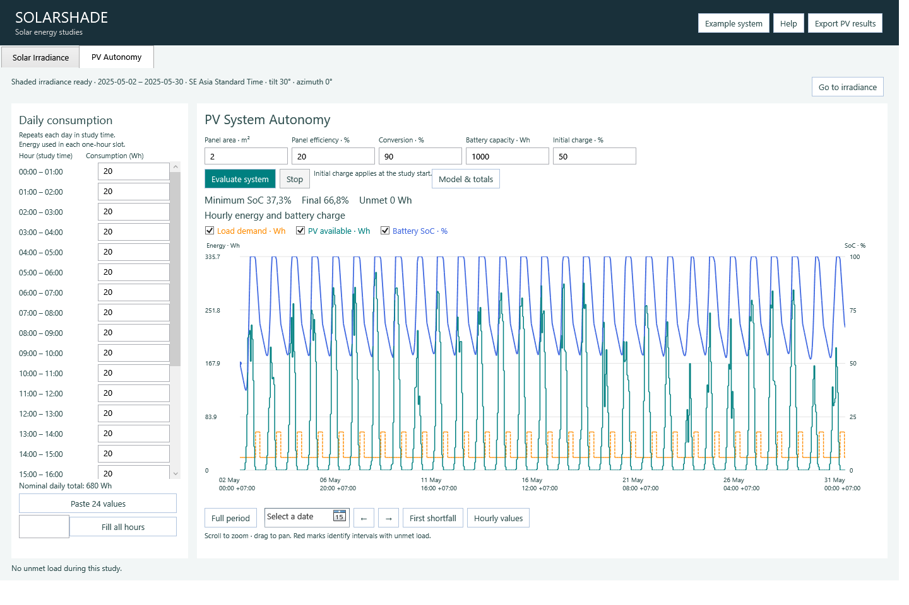
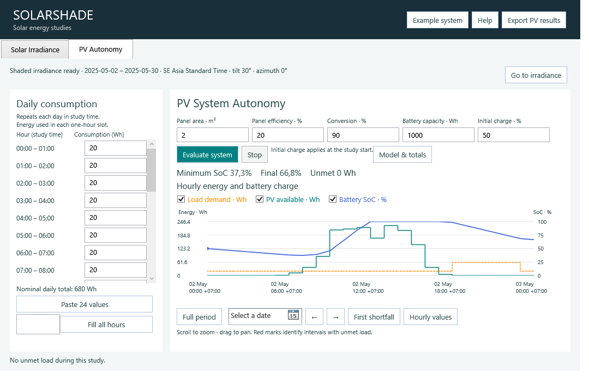

# Frontend workspace delivery record

## Part I: tabbed frontend foundation

29 September 2026. Existing behavior is now hosted in **Solar Irradiance**. The shell constructs each workspace once; its local view/controller owns inputs, subscriptions and cancellation. `IIrradianceService` exposes accepted source readiness without requiring dependent views to inspect upstream controls.

Optional artifacts share the existing storage lease, with a separate owner marker and sidecar manifest. They never add requirements to upstream completeness. Publication/export verify source files, settings/source identity and artifact bytes; an interrupted or stale writer cannot publish a current dataset. Existing manifests need no migration. Cache keys now use an explicit irradiance orchestration schema and scientific-library identities, so changing a PV assembly does not discard upstream science. Old cache entries are safely missed once.

Verification:

- Release solution test run: 466 passed, no failures (145 frontend, including six new workspace/storage tests).
- Standalone self-contained application published and packaged smoke workflow passed: explicit example update, overlays, panel changes, cancellation and verified irradiance export.
- Rendered screenshots reviewed at the default window size. Existing chart and all original controls remain in the first tab; workspace actions remain in the header.
- No numerical equations, mandatory output files or one-page irradiance report were changed.

Part I is [PR #7](https://github.com/ckbk123/FisheyeSolarShadeForecast/pull/7). Orientation optimization remains a future isolated service, outside these two PRs.

## Part II: PV Autonomy

The second implementation builds on Part I. The new workspace contains an independently scrolling 24-hour consumption editor at left, five system settings at the top right and a combined chart below. Both energy curves use one Wh scale; SoC uses a fixed 0–100% scale. Interval bounds, UTC offsets and partial-hour indicators are available in hover and a keyboard-accessible hourly table. Initial charge, minimum charge and shortfalls use the backend's returned values. Long plots use per-pixel extrema envelopes rather than averaged values, retaining shortfall marks.

`PvSettingsDraft` parses visible input and persists versioned drafts independently. `PvWorkspaceController` owns revision, cancellation and result state. `PvEvaluationService` consumes a frozen source and calls the existing backend off the UI thread. `DependentResultStore` publishes all three artifacts as one optional scope. PV-only changes never recalculate or invalidate irradiance. Evaluation and export are explicit, with source rechecks and stale-result rejection. Only one workspace calculation runs at a time. Closing cancels the dependent controller before disposing the shared service.

The only backend compatibility addition is support for the frontend's `Fixed/UTC±HH:mm` study zones in both simulation and the offline validator. Energy equations and existing named-zone DST behavior are unchanged.

Verification:

- Release solution: **492 tests passed**, no failures (165 frontend, 68 core battery, 3 battery integration, and the existing upstream suites).
- Seventeen new frontend cases cover percentage conversion, invalid values, atomic paste, direct-backend parity, independent invalidation, byte-identical export, duplicate requests, late completion after edits/Stop/source changes/disposal, modified artifacts, draft restoration, and source files changed without a watcher callback.
- Six new backend cases cover fixed offsets, local-hour load matching, positive/negative fractional offsets and invalid offset limits. Existing tests retain the partial-hour, DST, subhour depletion/recovery, clipping and energy-balance coverage.
- Three chart cases render the WPF control and verify shortfall marks after subhour recovery, preservation through dense display reduction, zero charge without shortfall, view-only navigation and offset-qualified partial-hour details.
- Self-contained published application smoke workflow passes both tabs, all 696 example reporting hours against a direct backend call, settings persistence, verified exports and the existing native irradiance workflow. The example has 19,720 Wh requested load, zero unmet energy and minimum charge 37.3063%; these are illustrative model outputs, not a reliability guarantee.
- WPF render previews cover 1440 × 960 and 1080 × 720 logical window sizes, with 100%, 125% and 150% output DPI at minimum size. These are rendering checks, not an assertion that Windows monitor scaling was changed during the test. The minimum-size preview prompted a more compact source strip and separate model/totals dialog to preserve graph height.
- Interactive packaged-app checks confirm the disabled-then-enabled dependency tab, explicit example preset, explicit evaluation, matching 696-hour summary, accessible labels for all 24 load slots, keyboard movement between hourly fields, and immediate blocking of evaluation/export with a stale-result label after invalid battery input.

No new charting dependency, battery PDF, optimizer or result restoration cache is introduced. Drafts restore on restart; accepted results require explicit evaluation against a current source. CSV/JSON/XLSX and the optional manifest form the PV export; the original irradiance PDF remains one page.

