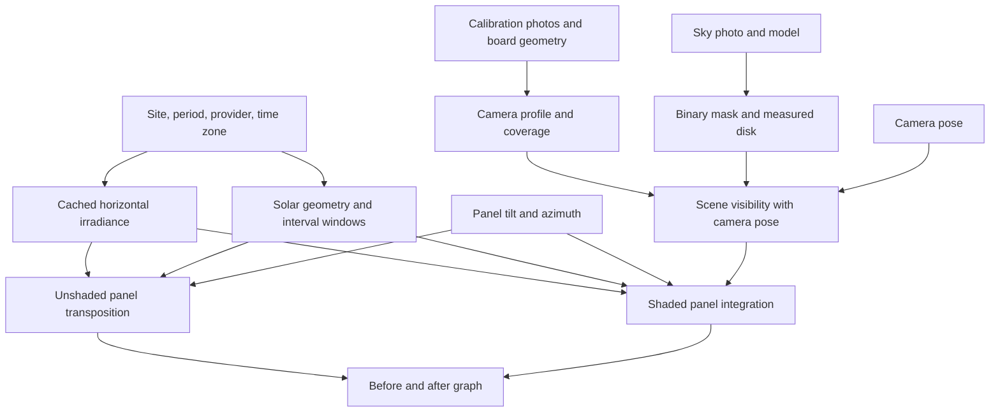

# ApplicationFrontend

The current frontend has Solar Irradiance and PV Autonomy workspaces. It owns UI input, sequencing, cache coordination and rendering. Calibration, masking, irradiance intervals, solar geometry, transposition, shading, PV/battery simulation and their native exports are owned by the libraries. See [current architecture](../../docs/APPLICATION_ARCHITECTURE.md) and [running and output formats](RUNNING.md).

Each explicit Solar Irradiance update saves affected numbered stage outputs under the one current top-level `Debug Data` dataset. PV Autonomy adds an optional `07-battery` result after a separate evaluation. Irradiance intervals determine every downstream result's cadence. The current APIs are documented in the architecture page; the material below is preserved as an **archived initial design**, including superseded gaps and export behavior.

The mask preview now opens a separate modal paint window through **Edit mask**. Black marks obstruction; white marks open sky. The editor has native-pixel brush size, opacity and zoom sliders, pan, undo/redo and reset. Saving creates a named immutable variant under `Data/Masks`, preserving the AI source mask; the mask dropdown selects the variant used for shading. The main app owns variant persistence, result invalidation and export provenance. Exact accepted studies, including matching optional PV results, can be restored from `Data/AcceptedResults` without rerunning their scientific calculations. See [running and output formats](RUNNING.md) for the current workflow.

## Archived initial workflow and implementation evaluation

Initial specification v0.1 · 6 September 2026. A runnable test build now implements this workflow; see [running, packaging and validation](RUNNING.md). The sections below preserve the initial design evaluation, including gaps that existed before the test build.

This folder belongs to the existing `BKHCM/Solar Forecast Estimator/src` tree. The requested folder location was interpreted as `src/ApplicationFrontend` within this project, consistent with its other modules.

## 1. Product objective and scope

A Windows desktop application lets a user select calibration photos and a sky photo, describe the camera pose and site, choose an irradiance period/provider, and tune panel tilt/azimuth. It displays the black/white sky mask and compares irradiance on that panel before and after obstruction shading.

The main graph's baseline is **already adjusted for panel tilt and azimuth**. Raw horizontal irradiance is retained for reuse and export; it is not the default baseline curve. Both displayed curves refer to the same panel, site, weather source, period, interval convention and diffuse model.

V1 covers a single site, one active sky photo, one camera profile and one panel orientation at a time. A static obstruction scene represents the selected historical period. It estimates front-side direct plus sky-diffuse irradiance in W/m². Forecast weather, PV electrical watts/kWh, panel area/efficiency, ground reflection, rear-side irradiance, automatic orientation optimization and multi-site comparison are outside this first specification.

The current distribution is a portable Windows x64 folder containing a self-contained executable, external Example inputs/reference outputs, and Data for settings/caches. The models remain embedded. It requires no Python, Excel installation, model downloads or manual runtime setup. See RUNNING.md for the implemented package and verification; the remaining sections here preserve the original design evaluation. Internet is needed to retrieve uncached irradiance data.

## 2. Decisions and proposed defaults

User-confirmed requirements: folder selection for calibration and sky photos; editable camera and panel pose; latitude, longitude, elevation and date range; two irradiance providers with PVGIS excluded; selectable segmentation model; automatically updating mask and graph; retained horizontal and tilt-adjusted XLSX outputs.

The following are proposed defaults awaiting the user's answers. They are not recorded as approved:

| Decision | Proposed behavior |
|---|---|
| Two provider choices | NASA POWER and Open-Meteo, the two with saved successful live verification. No PVGIS entry. |
| End-date meaning | Inclusive calendar day in the selected time zone: 01.05.2025–31.05.2025 includes the entire last day. |
| Main graph | Two total-irradiance curves with optional direct/diffuse component toggles. |

Other draft choices: B5 segmentation at 1024 resolution initially, with B4–B7 selectable and 512 available under advanced settings; Perez–Driesse initially, with Hay–Davies and an isotropic baseline in advanced settings; camera image bottom south and optical axis vertical; panel tilt 0°, azimuth 180° as visible, editable starting values. None of these defaults implies that they are optimal or measured for the user's site. The distribution model selection remains open: all four bundled models preserve all offline choices but make the download much larger than a one-model edition.

## 3. Required inputs and conventions

| Input | User-facing meaning and behavior |
|---|---|
| Calibration folder | Read supported JPEG/PNG checkerboard photos; list selected files and show per-photo detection results. Ignore unrelated files. Reuse a saved profile after the first successful calibration. |
| Checkerboard inner columns / inner rows | Count interior corner intersections, not squares. Show a small labeled board example. A board with 7 × 10 squares has 6 × 9 inner corners. |
| Square side length | Physical side length of one square in millimetres; finite and positive. Existing library defaults are 6 × 9 inner corners and 22 mm, but the user must confirm their actual board values. |
| Sky-photo folder and active photo | If one supported photo exists, select it; if several exist, show thumbnails and require an active selection. Never silently use the first file in directory order. |
| Camera/profile match | Same physical lens setup, image geometry and orientation convention as calibration. Matching JPEG/PNG extensions alone is insufficient. No silent cropping, stretching or re-centering. |
| Image-bottom bearing | Degrees clockwise from true north; default 180° (south), so image top is north. Display cardinal labels and an orientation preview. |
| Camera tilt | Optical-axis tilt from vertical, default 0°. A tilted camera needs its tilt direction as well as magnitude. See the pose rule below. |
| Camera roll | Advanced input, default 0°; rotation of the image axes around the optical axis. |
| Panel tilt | 0° horizontal/upward-facing through 90° vertical; slider plus numeric field. |
| Panel azimuth | Direction the panel front faces; true north 0°, east 90°, south 180°, west 270°. Normalize 360° to 0°. At zero panel tilt it has no physical effect, but retain the selected value. |
| Latitude / longitude | Decimal degrees with N/S/E/W cues; latitude −90…90, longitude −180…180. Separate controls avoid reversing their order. |
| Elevation | Metres above sea level; explicitly supplied or visibly accepted as an estimate. Do not silently treat photo height above the roof as site elevation. |
| Time zone | Visible field, initially the computer's zone and editable. GPS coordinates do not determine a zone in the present libraries. Needed even when display dates use a fixed format. |
| Start / end date | Date picker plus strict DD.MM.YYYY entry; reject invalid dates and reversed ranges. Proposed inclusive end date; confirm before implementation. Historical-data availability errors identify the provider and requested period. |
| Irradiance provider | Only the agreed two choices in this UI. Changing providers never silently substitutes data or resamples one provider to resemble another. |
| Segmentation model | B4/B5/B6/B7 by readable names. Model choice changes the mask; it does not change the camera calibration. |

Camera pose rule: the backend's positive `CameraPose.TiltDegrees` tilts the optical axis toward `ImageTopAzimuthDegrees`. With default roll 0, the UI's bottom-bearing input maps to `ImageTopAzimuthDegrees = (bottomBearing + 180) % 360`. Explain tilt direction with a preview. A generic phone inclination number without a direction is insufficient to describe arbitrary placement. Provide an advanced pose editor for roll and a tested mapping for arbitrary phone poses; do not treat a phone's sensor pitch/roll as interchangeable with these fields. Heading refers to true north; automatic magnetic correction is not currently provided.

All image coordinates refer to the EXIF-oriented image shown to the user. Display the active image dimensions and profile pairing. Sensor GPS/orientation autofill is optional future convenience, not a prerequisite for manual use.

Calibration coverage is additional profile information, not something users should guess. The profile must carry a defensible angular limit and the measured image disk. Fitted checkerboard coverage is not independent proof of accuracy at the lens edge. Do not apply the example's 66.43° limit to every user's camera. Automated candidate limits, visual review and independent verification need a defined profile-acceptance workflow before release.

## 4. Proposed user workflow

1. **Select calibration folder and describe the board.** Show detected/failed boards and calibration progress. An explicit Calibrate action commits the image set and board settings. After success, show fit error, usable-coverage status and previews; save a reusable camera profile. Editing panel settings never recalibrates the camera.
2. **Select the sky-photo folder and active image.** Generate the mask once the image/model inputs are valid. Display Original / Mask / Overlay modes and detected lens boundary. Mask generation can proceed while unrelated calibration/download work is pending. A failed disk detection requests a profile disk or corrected image rather than inventing a mask.
3. **Enter camera pose, site, dates and provider.** Show units and compass cues. When the network-affecting settings are valid and committed, retrieve data or reuse the matching cache. A Refresh data action explicitly bypasses the cache.
4. **Tune panel orientation.** The unshaded panel curve becomes available as soon as irradiance and solar geometry are ready, even if calibration or masking still needs attention. The shaded curve appears only when its additional inputs and validated backend stage are ready.
5. **Inspect and export.** Hover shows time, interval, irradiance components and coverage. Save the workspace and export the raw horizontal, unshaded panel and shaded panel series for the selected configuration.

Recommended screen structure: left input pane grouped as Images/Calibration, Camera, Site/Period and Panel; right upper image/mask preview; right lower graph with legend and zoom; a compact status area identifies the current stage and freshness. Detailed diagnostics belong in an expandable area. Keep the panel sliders and graph visible together during tuning.

## 5. Automatic updates and dependency rules

“Continuously updating” means automatically recomputing affected outputs after valid committed edits. It does not mean repeated network calls, repeated neural inference, or repeated workbook writes on every slider event.

| Changed input | Work to invalidate/recompute | Work to reuse |
|---|---|---|
| Calibration folder or board settings | Calibration on Calibrate; downstream projection/coverage and shaded curve after success | Raw irradiance and unshaded panel curve; mask unless image/disk preprocessing changes |
| Active sky photo | Disk detection, mask, visibility and shaded curve; recheck profile compatibility | Raw irradiance, solar positions and unshaded panel curve |
| Segmentation model/resolution or disk crop | Mask and shaded curve | Calibration, downloaded data and unshaded panel curve |
| Camera bearing/tilt/roll | Projection/visibility and shaded curve | Encoded binary mask, raw irradiance and unshaded panel curve |
| Panel tilt/azimuth | Both panel curves and their summaries | Calibration, binary mask, raw irradiance, solar geometry and reusable scene visibility |
| Latitude/longitude | Provider data for the new site, solar geometry and both panel curves | Compatible calibration and binary mask |
| Elevation | Solar geometry and both panel curves | Provider data when elevation is not an input to that adapter; calibration and mask |
| Dates / time zone / provider | Resolve data cache, interval selection, solar geometry and both panel curves | Calibration and binary mask |
| Diffuse transposition model | Both panel curves with consistent diffuse shading treatment | Raw data, calibration and mask |
| Zoom / component toggles | Render the view | All scientific results |

Draft scheduling targets: debounce local numeric/slider edits by about 200 ms and commit on release/Enter; debounce valid network settings by about 800 ms after commit. These are proposed UI behavior, not measured guarantees. Intermediate malformed text never starts work. Only the newest input revision may publish a result. Coalesce fast edits and bound queued work; do not queue every slider position.

Run computation off the UI thread. Cancel outdated work where the library supports it. Full calibration and mask inference currently lack public cancellation tokens: allow an active call to finish, discard obsolete results, and run only the newest pending request. Reuse one masker/session and serialize its calls; load the selected model lazily. Coordinate native OpenCV global thread settings when calibration and masking overlap, or serialize those stages until this interaction is verified.

Retain the previous graph while updating, visibly marked as the previous configuration. Never combine a new baseline with an old shaded curve as if both were current. Statuses include Awaiting input, Ready, Downloading, Calibrating, Segmenting, Calculating, Out of date and Failed. A failing shading stage need not erase a valid unshaded baseline. Retry and actionable error messages belong beside the affected stage.

## 6. Calculation contract and existing backend readiness

Existing: native calibration, all four ONNX mask models, historical BHI/DHI extraction, solar geometry, horizontal isotropic shading, horizontal correction, and unshaded panel transposition/XLSX export. The tilt compensator's XLSX output is complete and already validated. See [the backend audit](../../docs/BACKEND_PORT_AUDIT_2026-09-06.md).

Missing for this interface: application orchestration/state/cache, profile acceptance/persistence, the combined shaded-panel calculation, its typed results/export and integration validator, the UI and distributable package. This specification does not redefine the finished tilt compensator as missing.

The combined calculation must integrate direct visibility with panel incidence over the same provider intervals used by the baseline. The existing horizontal hourly shading factor is not a universal panel multiplier. For diffuse light, the masked result must be consistent with the selected isotropic/Hay–Davies/Perez–Driesse treatment and receiver orientation. The exact diffuse masking formulation, including treatment of horizon and circumsolar contributions, is an engineering decision requiring independent validation before the final shaded curve is considered complete. Existing aggregate diffuse output alone does not provide that directional visibility calculation.

Use common solar/time conventions for the two curves and the projected sky rays. Current transposition explicitly converts geometric to apparent zenith while existing shading uses geometric positions. Resolve this explicitly in the combined stage, including horizon behavior; do not compare mismatched substep geometry. Preserve existing standalone functions and their tests during this work.

Missing image coverage retains lower/upper bounds. The default existing policy assumes unobserved sky is blocked; surface that assumption near the shaded graph. A conservative computed estimate is not measured obstruction outside the photo. An advanced unknown-coverage mode should show gaps/bounds rather than zero irradiance. Never silently clamp unexplained before/after inconsistencies to make the graph plausible.

## 7. Time semantics, graph and exports

All internal times are offset-aware instants. Retain provider, native label and interval start/end. NASA POWER uses following-hour windows; Open-Meteo uses preceding-hour windows in the current adapters. Do not apply an extra arbitrary one-hour shift to their labels.

If inclusive dates are approved, translate the UI end date into the next local midnight for the backend's exclusive bound, with DST-aware conversion. There is a further integration requirement: the existing downloader filters native timestamp labels, while an end-labeled first row can describe the preceding day. The application must fetch sufficient boundary data and explicitly map intervals onto the requested period. Decide and test clipping/weighting of partial boundary intervals before claiming exact date-range coverage or energy totals; a mere `AddDays(1)` does not resolve provider-window differences. Do not silently resample away source conventions. Graph hover must expose the represented interval.

Main graph labels:

- **Panel irradiance — before obstruction shading**.
- **Panel irradiance — after obstruction shading**.

Y-axis: W/m²; X-axis: local date/time with selected time zone visible. Proposed total curves are direct + sky diffuse; component toggles use consistent colors/styles. Show genuine missing/unknown values as gaps. Preserve nighttime rows. Downsample only for rendering long periods; exports and calculations retain full series precision. Any daily/monthly energy view must integrate interval durations and use kWh/m², not electrical kWh.

Retain these separate XLSX artifacts; workbook writes are a save/export operation, not part of every live graph update:

| Output | Data columns |
|---|---|
| `horizontal-irradiance.xlsx` | Timestamp, direct horizontal, diffuse horizontal |
| `panel-unshaded-<scenario>.xlsx` | Timestamp, direct on panel, sky diffuse on panel |
| `panel-shaded-<scenario>.xlsx` | Timestamp, shaded direct on panel, shaded sky diffuse on panel |

Use a scenario identifier so different angle settings do not silently overwrite each other. Exports capture one completed revision; never a mixture of results from different settings. Save orientation, provider, source-fetch time, site/zone, interval convention, model/settings and coverage policy in metadata or a companion manifest. The shaded result must retain uncertainty/coverage in a companion result record even when the three-column workbook remains simple. Failed writes preserve existing files. Incomplete current results disable their export, while a clearly labeled previous scenario can remain exportable.

## 8. Project state and cache

Keep separate records for CameraProfile, ImageMask, RawIrradianceDataset, ScenarioInputs and ScenarioResult. Use a versioned project manifest to save input paths/content hashes, profiles and settings. On reopen, verify referenced files; offer relocation if missing. Cache keys include every scientific dependency and algorithm/model version. Changing an angle must never trigger a new API request or recalibrate the camera.

Cached data remains usable offline with its provider, retrieval timestamp and requested coverage visible. Fetch failures never switch providers or fabricate zeros. Calculation does not require XLSX re-reading between stages; use the existing typed sample APIs, with XLSX as durable user-facing output. Cache lifetime/size and default save location are implementation decisions still to settle.

## 9. Delivery sequence and acceptance criteria

1. Settle the three user-facing decisions above and camera/profile conventions. Produce a screen mockup only after the workflow is coherent. Choose the native Windows UI framework separately; none has been imposed by this draft.
2. Build an application service composing the existing download, calibration, mask and unshaded-transposition APIs. Add profile/state management and interval-aware cache selection.
3. Implement and validate shaded-panel integration with matched direct/diffuse assumptions. This is required for the requested final comparison graph.
4. Implement the responsive UI, revision-safe updates, image inspection and scenario exports.
5. Publish the self-contained executable and test first launch, repeat launch, CPU fallback and offline cached work on clean target Windows systems.

Acceptance evidence must establish:

- A supported photo set and entered checkerboard geometry produce a reusable profile with explicit quality/coverage status; failed detections and incompatible sky images are actionable.
- Selecting a model regenerates the binary mask at the correct oriented dimensions. Changing camera or panel pose does not rerun segmentation.
- Changing panel angles updates both panel curves without a download or calibration call; azimuth has no effect for a horizontal panel under otherwise identical settings.
- Before-shading values match the existing transposition validator. Fully visible supported sky matches the baseline under matched assumptions; fully blocked sky removes direct and sky-diffuse components; partial visibility and horizontal special cases match independent calculations. Temporal beam weighting, tilted diffuse distributions and missing coverage are covered explicitly.
- Both date boundaries, following/preceding-hour providers, DST cases and incomplete provider coverage are verified. The displayed interval and exported instant agree.
- Rapid slider edits publish only the latest revision, errors do not mislabel stale results, and the UI remains interactive during calibration, inference and networking.
- Exported numbers equal the completed displayed scenario before rendering downsampling; raw horizontal data remains unchanged across panel scenarios.
- A clean-machine user opens one executable and reaches the UI without installing Python, Excel or .NET manually. Required native prerequisites must be bundled or handled by the distribution. Offline masking works with bundled models; cached calculations work without network.

Do not set a universal sub-100-ms or sub-second first-launch promise. Current measured model startup is seconds, and all four model files alone total about 643 MB. Show the UI before model loading and measure perceived responsiveness separately from calculation and extraction time. Final size and OS support require an actual publish/clean-machine test; below 100 MB is not a supported target with the current full offline asset set.

## 10. Remaining decisions

Pending user answers: the two providers; inclusive end date; total-versus-component default graph.

Resolve during detailed design: default output/cache location and persistence behavior; whether the first distribution bundles all four models; UI framework; arbitrary camera-pose controls; calibration coverage acceptance and disk editing; interval-boundary policy; exact tilted diffuse shading formulation. These do not prevent drafting the interface, but the scientific items must be resolved before a finished shaded-panel workflow is claimed.
